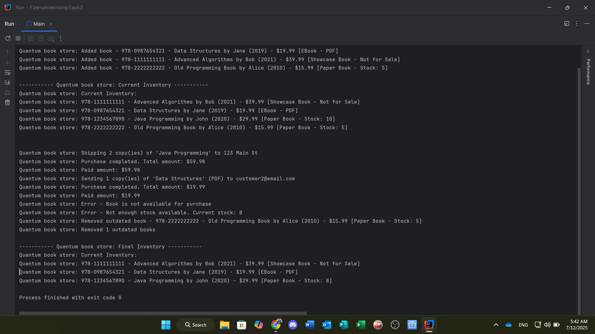

# 📚 Quantum Bookstore

## 🧩 Objective

Design an online bookstore with the following features and design principles.

---

## 🏷️ Book Types

The inventory may contain different types of books:

- **Paper Book**  
  - Has stock (quantity)  
  - Can be shipped

- **EBook**  
  - Has a file type (e.g., PDF, EPUB)  
  - Can be sent via email

- **Showcase/Demo Book**  
  - Not for sale

---

## ✨ Required Features

- Add a book to the inventory with:
  - ISBN (just any string identifier)
  - Title
  - Year of publication
  - Price
  - Author name

- Remove and return **outdated books** that have passed a specific number of years.

- **Buy a single book** by providing:
  - ISBN
  - Quantity
  - Email
  - Address

### ✅ On Successful Purchase:
- Reduces the quantity of the book from the inventory.
- Returns the **paid amount**.
- Sends:
  - **Paper books** to `ShippingService` with the provided address *(no implementation required)*.
  - **EBooks** to `MailService` with the provided email *(no implementation required)*.

---

## 🧪 Testing

You must provide a class to test:

- Adding books
- Removing outdated books
- Buying books

---

## 🔧 Design Notes

- The system should be designed to be **easily extensible**, so that new types of products can be added **without modifying existing logic**.

---

